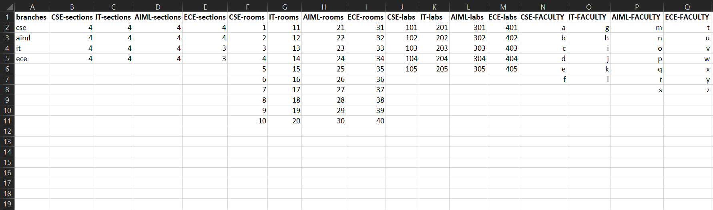
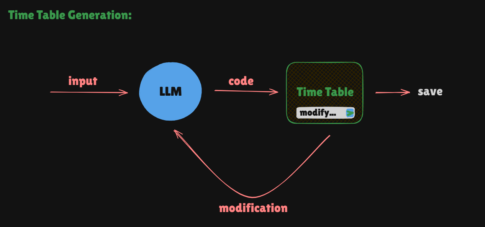
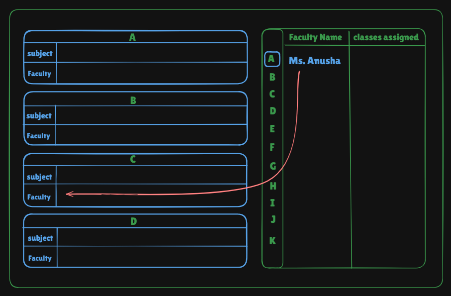

# <span style="color:red">Goals</span>🎯
- **Classroom Management**
- **Timetable Management**
- **Faculty Management**


## <span style="color:lime">Features of the Timetabular</span>
- **Allocate classes to all sections of all years** ✅
- **Empty Classroom Management** (Query available rooms) ✅
- **Generate Multiple Timetables** (4 sections at once)
- **Modify Timetables** (like Bolt.new)
- **Export/Print** (Excel, PDF, Image)
- **Save Timetables** (Auto-save feature)
- **Faculty-Specific Timetables** (Only their assigned lectures)
- **Faculty Burnout Ratio** (optional)
- **Faculty Allocation** (Find free faculty for substitution)
- **Conflict Resolution** (Handle faculty/classroom clashes)
- **Dynamic Faculty Changes** (Reassign if a faculty leaves)


---

## 📙 <span style="color:yellow">Data That Needs To Be Uploaded Initially</span>

[Download Excel File](./timeTabular-structure.xlsx)

It contains:



- **Branches** (CSE, ECE, IT, etc.)
- **Year Wise Sections Of Each Branch**
- **Rooms, Labs, and Faculty Of Each Branch**

`Note`: <span style="color:yellow">Tentative Format (may change)!</span>

---

## 🌟 <span style="color:pink">Allocation of Classes and Empty Room Finding</span>

### 🛠️ **Modus Operandi (Plan of Action)**  
Our system aims to efficiently manage classroom allocations and track available rooms. Below is the step-by-step approach:

1. **Database Structure**  
   - We have a `classes` table that categorizes rooms based on branches (CSE, ECE, IT).
   - Each branch has a dedicated table listing all its rooms.

2. **Room Allocation Tracking**  
   - Each room has two key attributes:  
     - `assigned` → **"Yes"** if occupied, **"No"** if free.  
     - `assignedTo` → If occupied, stores which class (e.g., **"3-B"** for 3rd-year Section B) is using the room; otherwise, it's **NULL**.

3. **How Room Allocation Works**  
   - When a class is assigned a room, we update:  
     - `assigned = "Yes"`  
     - `assignedTo = "Year-Section"`  
   - When a room is freed, we reset:  
     - `assigned = "No"`  
     - `assignedTo = NULL`

4. **Finding Empty Rooms**  
   - Query all rooms where `assigned = "No"` to get available classrooms.

5. **Ensuring Conflict-Free Allocation**  
   - Before assigning, check that the room is not already allocated.
   - Allow real-time updates to prevent clashes.

---

### `classes` Table  
| id | branch |  
|----|--------|  
| 1  | CSE    |  
| 2  | ECE    |  
| 3  | IT     |  

### `cse` Table  
| room   | assigned | assignedTo |  
|--------|---------|------------|  
| C-101  | No      | NULL       |  
| C-102  | No      | NULL       |  
| C-103  | No      | NULL       |  
| C-104  | No      | NULL       |  
| C-201  | No      | NULL       |  
| C-202  | No      | NULL       |  
| C-203  | No      | NULL       |  
| C-204  | No      | NULL       |  
| C-301  | No      | NULL       |  
| C-302  | No      | NULL       |  
| C-303  | Yes     | 3-B        |  
| C-304  | No      | NULL       |  
| C-401  | No      | NULL       |  
| C-402  | No      | NULL       |  
| C-403  | No      | NULL       |  
| C-404  | No      | NULL       |  

### `ece` Table  
| room   | assigned | assignedTo |  
|--------|---------|------------|  
| S-101  | No      | NULL       |  
| S-102  | No      | NULL       |  
| S-103  | No      | NULL       |  
| S-104  | No      | NULL       |  
| S-201  | No      | NULL       |  
| S-202  | No      | NULL       |  
| S-203  | No      | NULL       |  
| S-204  | No      | NULL       |  
| S-301  | No      | NULL       |  
| S-302  | No      | NULL       |  
| S-303  | No      | NULL       |  
| S-304  | No      | NULL       |  
| S-401  | No      | NULL       |  
| S-402  | No      | NULL       |  
| S-403  | No      | NULL       |  
| S-404  | No      | NULL       |  

### `it` Table  
| room   | assigned | assignedTo |  
|--------|---------|------------|  
| N-101  | No      | NULL       |  
| N-102  | No      | NULL       |  
| N-103  | No      | NULL       |  
| N-104  | No      | NULL       |  
| N-201  | No      | NULL       |  
| N-202  | No      | NULL       |  
| N-203  | No      | NULL       |  
| N-204  | No      | NULL       |  
| N-301  | No      | NULL       |  
| N-302  | No      | NULL       |  
| N-303  | No      | NULL       |  
| N-304  | No      | NULL       |  
| N-401  | No      | NULL       |  
| N-402  | No      | NULL       |  
| N-403  | No      | NULL       |  
| N-404  | No      | NULL       |  

Now we can update `assigned` to "Yes" and fill `assignedTo` whenever a room is allocated!

---

## 🌟 <span style="color:pink">Time Table Creation</span>

`Note`: <span style="color:yellow">At this point the rooms have been assigned to all the classes!</span>

**General Workflow:**



**Inputs attained initially:**
- branches and their year wise sections
- room allocated to every section
- labs, faculty of each branch


**inputs needed for Time Table Generation:**
- Branch, year(sem), no.of.sections, subjects for that semester (with Abbreviations), and we can drag the faculty for each section [draggable].
- Previous TimeTable State from the 2nd Iteration



**Data sent to LLM:**

`Client Input`:
```json
{
   "branch": "cse",
   "year": "3",
   "semester": "1",
   "sections": "2",
   "subjects": {
      "1": "DBMS",
      "2": "OS",
      "3": "CN",
      "4": "Maths",
      "5": "CN Lab",
      "6": "DBMS Lab"
   },
   "faculty": {
      "section-A": {
         "DBMS": "Dr. John Doe",
         "OS": "Prof. Jane Smith",
         "CN": "Mr. Alan Brown"
      },
      "section-B": {
         "DBMS": "Dr. John Doe",
         "OS": "Prof. Jane Smith",
         "CN": "Mr. Alan Brown"
      }
   }
}
```

`Background Data That is sent to LLM`:
```json
{
   "Room": "C-303",
   "Lab Availability": {
      "mon": {
         "N-205": {
            "FN": 1, // 1 -> booked
            "AN": 1,
         },
         "S-208": {
            "FN": 1,
            "AN": 0, // 0 -> available
         }
      },
      "tue": {
         "N-205": {
            "type": "computer",
            "FN": 0,
            "AN": 1,
         },
         "S-208": {
            "type": "semi-conductors",
            "FN": 1,
            "AN": 1,
         }
      },
      .
      .
      . // so on
   },
   "BlockedSlotsOfFaculty": {
      "Mr. Pramod": {
         "9:40 - 10:40": 1 // 1 -> Not available at this time.
      },
      "Mr. X": {
         "1:20 - 2:20": 1
      },
      .
      .
      . // so on
   }
}
```

`Response Sent By LLM`:

```json
{
   "branch": "CSE",
   "section-A": {
      "table1": { // the time table data
         "mon": [ // lectures and labs on monday
            {
               "lecture": "CD",
               "colspan": 1 
            },
            {
               "lecture": "FSD",
               "colspan": 1 
            },
            {
               "lecture": "EIA",
               "colspan": 1 
            },
            {
               "lecture": "FSD LAB",
               "colspan": 3 
            },
         ],
         "tue": [
            // lectures and labs(if there are any) on tuesday
         ],
         ..
         ..  // till saturday  (inclusive)
      },
      "table2": { // subjects and faculty data
         "subject1": ["subject Abbreviation", "subject faculty name"],
         "subject2": ["subject Abbreviation", "subject faculty name"],
         "subject3": ["subject Abbreviation", "subject faculty name"],
         .
         .
      }
   },
   "section-B": {
      // same structure here
   },

   // change that needs to be made in database.
   "mutations": {
      <!-- faculty mutations -->
      <!-- lab availability mutations -->
   }
}
```


